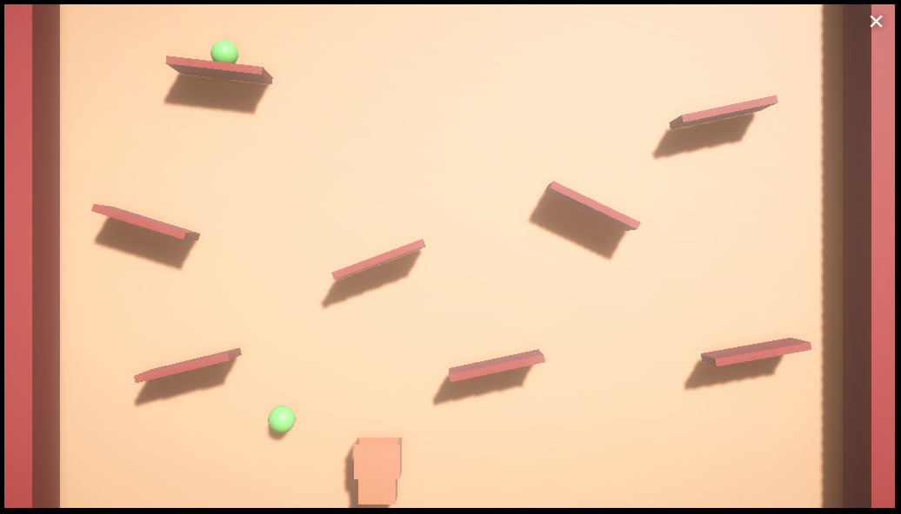

# bucketgame_basics

Jogo do balde seguindo tutorial da DIO

Link para jogar: https://play.unity.com/mg/other/webgl-builds-388755

### O que foi feito
* Criação dos assets a partir de componentes primitivos do Unity3D
* Level design
* Spawn de bolas, destruição das bolas que já passaram
* Detecção de colisão com balde e score de pontuação

### Backlog para trabalhar no jogo futuramente
* Criar interface UI que aponte score
* Temporizador
* Criar abertura, menu inicial e vários níveis
* Importar asset de balde da asset store da Unity
* Incluir música e sonoplastia
* Criar diferentes tipos de bolas e itens (uns com danos e outros positivos)
* Melhorar cores no WebGL